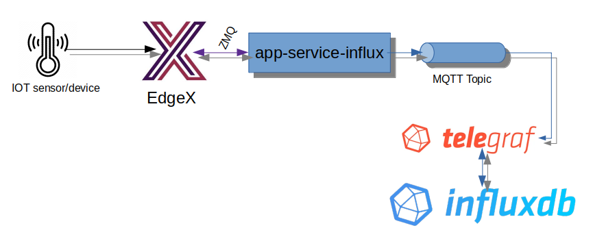

# EdgeX Foundry application service InfluxDB

EdgeX Foundry application service to export readings to InfluxDB via MQTT.  This service example was created with EdgeX Foundry version 1.3.0 (Hanoi).

The pipeline simply consists of two functions:
- conversion of EdgeX Event/Reading objects to Influx [line protocol](https://docs.influxdata.com/influxdb/v2.0/reference/syntax/line-protocol/)
- export of results to MQTT Sender, which is a MQTT topic that Telegraf / Influx is positioned to listen to and ingest data from

In this example, the MQTT Broker is assumed to exist on a different host and is accessed via port 1884.  The target topic is edgex/EdgeXEvents.  Modify the configuration.toml file to point the MQTT Sender to an alternate broker or topic.

No filtering or other transformation functions occur in this example.
No additional MQTT options (such as QOS or retry has been provided for with this example)

Please note, this example assumes "Insecure Secrets" are being used (i.e. that a username and password are required to access the MQTT broker/topic and these are provided by the configuration.)  Be sure to set `EDGEX_SECURITY_SECRET_STORE` to false by some means.  Could be via env var (with export) or os.Setenv("EDGEX_SECURITY_SECRET_STORE", "false") in the code.
